# AI-Hub — Flow Diagrams v2 (Mermaid) — NO FANFIC

> **Regen v2** — Każdy element ma dowód: plik + linie kodu.
> Elementy bez dowodu zostały USUNIĘTE lub oznaczone [BRAK CALLERÓW].
> Companion: `docs/FLOW_DIAGRAMS_EVIDENCE.md` z surowymi cytatami.
> Źródło: audit kodu `aihub/`, 2025-01

---

## CO BYŁO BŁĘDNE W POPRZEDNIEJ WERSJI

1. **FAISS / SentenceTransformer w diagramie /memory/search** — W v1 diagram sugerował że vector_engine (FAISS) jest używany w pipeline wyszukiwania. **FAŁSZ.** `retrieve_context()` w `memory_engine.py:193-250` używa TYLKO `vector_index.py` (TF-IDF in-process), NIGDY `vector_engine.py`. FAISS jest używany wyłącznie przy ZAPISIE (`process_turn → vector_hook → vector_engine.add_memory`).
2. **learning_engine oznaczony jako "MARTWY KOD"** — Poprzedni diagram mówił że nikt nie woła learning_engine. **PRAWDA ALE NIEKOMPLETNA.** `cognitive_controller.py:27` importuje i instancjuje `LearningEngine()`, ale **nigdy nie woła żadnej jej metody** (`.process_turn()` ani `.learn_from_reflection()`). Również `agent_api.py:84` importuje `agent_loop.run_loop` który NIE woła learning_engine.
3. **research_engine — brak informacji o placeholder** — W v1 nie zaznaczono że `_generate_placeholder_results()` zwraca **pustą listę** (linia 179-183). Research engine istnieje w kodzie ale zawsze zwraca 0 wyników.
4. **agent_worker / agent_tick pipeline POMINIĘTY** — v1 pokazywał tylko `agent_loop.agent_cycle` ale pominął główną pętlę runtime: `start_worker_once() → _run_loop() → agent_tick()` z `agent_engine.py`. To jest PRAWDZIWY aktywny agent, nie `agent_loop`.
5. **Memory GC "schedule_gc to no-op"** — To było poprawne, ale brakowało informacji KTO woła `collect_garbage()`. Odpowiedź: **NIKT w runtime**. Jedynym callerem jest potencjalny ręczny call.
6. **Diagram 8 (architektura) pokazywał strzałki "U → L1" i "A → L1"** — Sugerował że user/assistant msg idą bezpośrednio do L1. **FAŁSZ.** Idą przez `process_turn → add_episode(summary)` gdzie summary = `"U:{user_msg} || A:{assistant_msg}"`.

---

## 1. POST /memory/add — Pipeline zapisu

### DOWODY:

- Endpoint: `aihub/main.py:196-210`
- ensure_user: `aihub/psyche_engine.py:71-82`
- evolve: `aihub/psyche_engine.py:99-154`
- process_turn: `aihub/memory_engine.py:127-166`
- remember_turn: `aihub/vector_hook.py:3-10`
- add_memory (FAISS): `aihub/vector_engine.py:133-164`
- add_stm: `aihub/memory_engine.py:44-55`
- add_episode: `aihub/memory_engine.py:75-90`
- add_fact (warunkowy): `aihub/memory_engine.py:93-110`
- \_enforce_caps: `aihub/memory_engine.py:113-125`

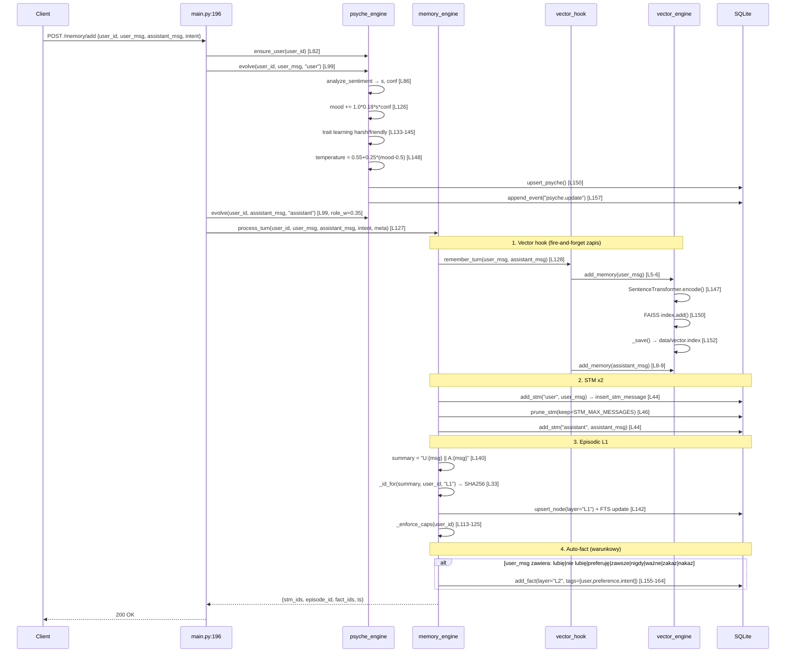

---

## 2. POST /memory/search — Pipeline odczytu

### DOWODY:

- Endpoint: `aihub/main.py:214-250`
- retrieve_context: `aihub/memory_engine.py:193-260`
- get_stm: `aihub/db.py:274-292`
- search_nodes_fts: `aihub/db.py:353-396` (FTS5 MATCH → fallback LIKE)
- \_vector_rerank (TF-IDF): `aihub/memory_engine.py:172-190`
- vector_index funkcje: `aihub/vector_index.py:13-95`
- FAISS/vector_engine: **NIE UŻYWANY** w search pipeline

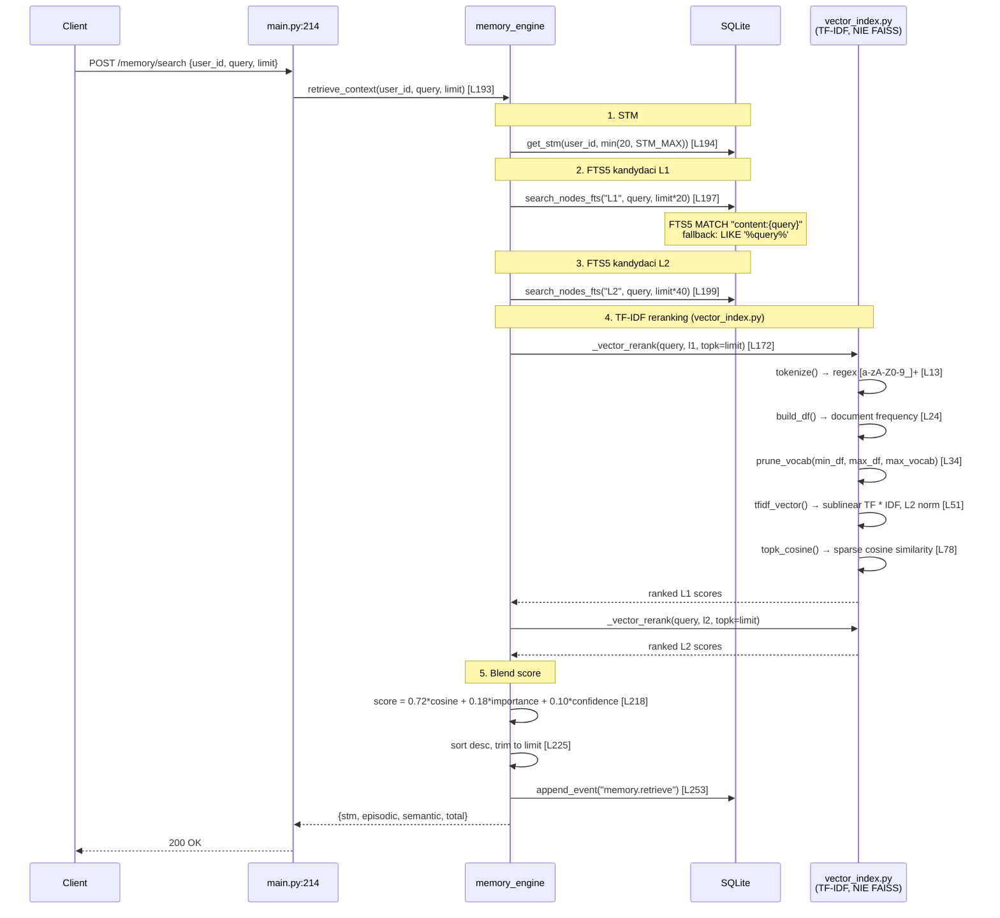

---

## 3. POST /psyche/update — Ewolucja psychiki

### DOWODY:

- Endpoint: `aihub/main.py:160-168`
- evolve: `aihub/psyche_engine.py:99-154`
- analyze_sentiment: `aihub/psyche_engine.py:86-97`
- \_POS/\_NEG/\_INTENSIFIERS: `aihub/psyche_engine.py:9-36`
- \_baseline: `aihub/psyche_engine.py:43-58`
- upsert_psyche: `aihub/db.py:181-199`

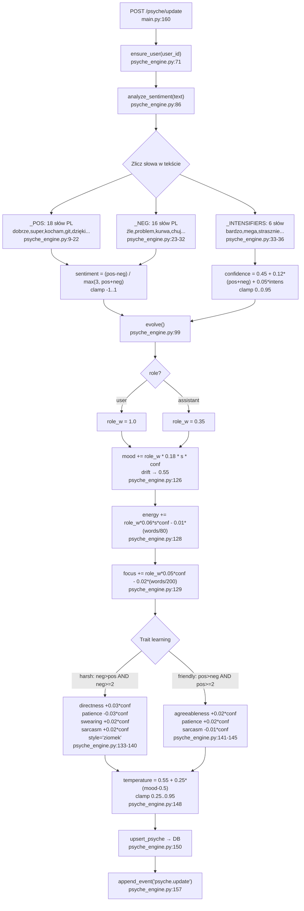

---

## 4. POST /psyche/reflect — Refleksja

### DOWODY:

- Endpoint: `aihub/main.py:172-190`
- retrieve_context: `aihub/memory_engine.py:193`
- reflect: `aihub/psyche_engine.py:157-193`

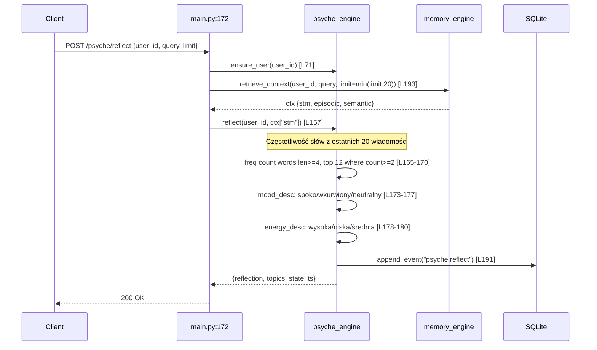

---

## 5. POST /cognitive/decide — System decyzyjny

### DOWODY:

- Endpoint: `aihub/main.py:365-410`
- CognitiveController: `aihub/cognitive_controller.py:71-83`
- decide(): `aihub/cognitive_controller.py:131-232`
- \_extract_intent: `aihub/cognitive_controller.py:234-250`
- predict_next_action: `aihub/prediction_engine.py:47-131`
- \_estimate_memory_pressure → meta_memory.check_stale: `aihub/cognitive_controller.py:409-420`
- ConflictDetector.check_conflict: `aihub/conflict_detector.py:70-118`
- \_check_resources (TTL 300s reset): `aihub/cognitive_controller.py:99-118`
- LearningEngine: importowany `cognitive_controller.py:27`, instancjowany w `__init__` L82, ale **NIGDY wołany**

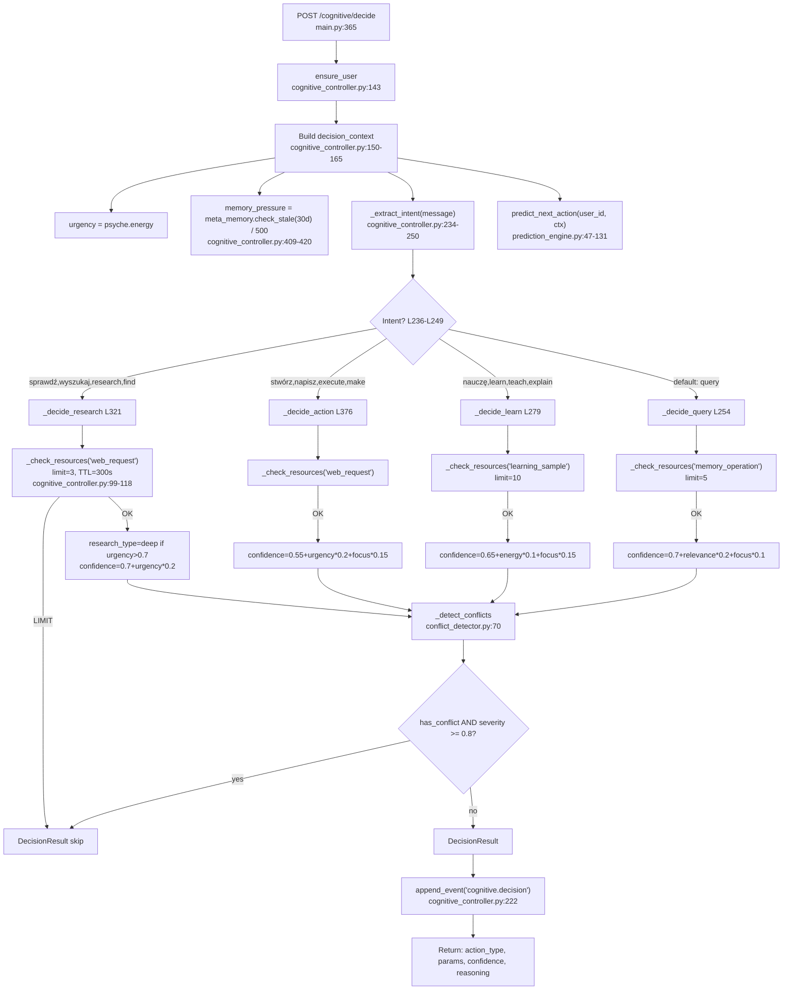

> **UWAGA:** `cognitive_controller.__init__` tworzy instancje `LearningEngine`, `KnowledgeGraph`, `AttentionController`, `ConflictDetector` — ale w `decide()` faktycznie wołane są TYLKO: `ensure_user`, `predict_next_action`, `_check_resources`, `_detect_conflicts`. **LearningEngine i KnowledgeGraph nie mają żadnych wywołań metod w decide().**

---

## 6. Agent Worker — Prawdziwa aktywna pętla runtime

### DOWODY:

- start_worker_once: `aihub/agent_worker.py:162-178`
- \_run_loop: `aihub/agent_worker.py:30-157`
- agent_tick: `aihub/agent_engine.py:296-400`
- Startup call: `aihub/main.py:96` → `start_worker_once()`
- extract_facts_from_text: `aihub/agent_engine.py:55-99`
- plan_from_text: `aihub/agent_engine.py:102-149`
- execute_task: `aihub/agent_engine.py:167-190`

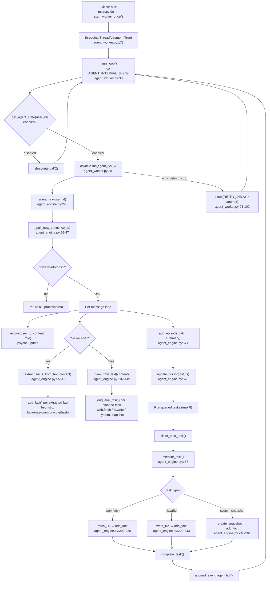

---

## 7. Agent Loop (via API) — [BRAK CALLERÓW AUTOMATYCZNYCH]

### DOWODY:

- Endpoint: `aihub/agent_api.py:88-93` (`POST /agent/loop`)
- run_loop: `aihub/agent_loop.py:272-296`
- agent_cycle: `aihub/agent_loop.py:169-267`
- \_execute_action **STUB**: `aihub/agent_loop.py:127-160`

> **WAŻNE:** Ten moduł NIE jest wołany automatycznie przez runtime. Jest dostępny TYLKO przez `POST /agent/loop` endpoint. `agent_worker` (diagram 6) woła `agent_tick` z `agent_engine.py`, a NIE `agent_cycle` z `agent_loop.py`.

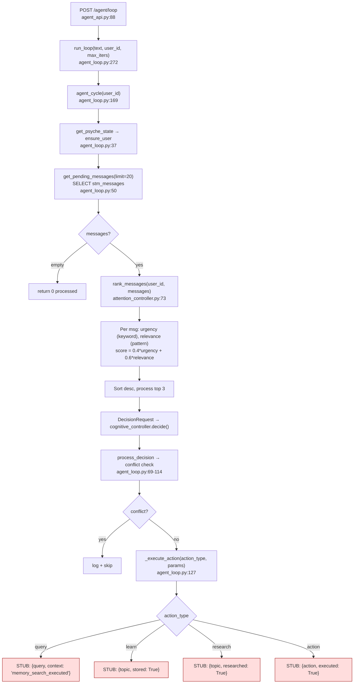

---

## 8. Memory GC Pipeline — [BRAK CALLERÓW W RUNTIME]

### DOWODY:

- collect_garbage: `aihub/memory_gc.py:44-130`
- check_stale: `aihub/meta_memory.py:157-187`
- \_archive_old_facts: `aihub/memory_gc.py:136-160`
- \_remove_low_priority_facts: `aihub/memory_gc.py:172-196`
- knowledge_evolution.evolve_all: `aihub/knowledge_evolution.py` (jeśli count>2000)
- schedule_gc: `aihub/memory_gc.py:217-218` — **LOGGER-ONLY, NO-OP**
- **KTO WOŁA?** Grep po `collect_garbage|schedule_gc|memory_gc` → **NIKT w runtime.** Tylko definicje w `memory_gc.py`.

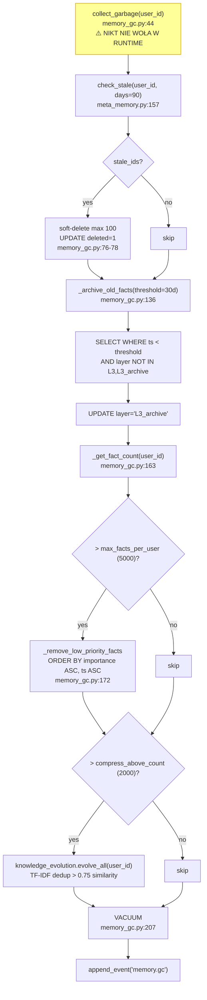

---

## 9. Autonauka — Trzy mechanizmy (z oceną aktywności)

### DOWODY:

- memory_engine auto-fact: `aihub/memory_engine.py:147-164`
- agent_engine extract_facts: `aihub/agent_engine.py:55-99`
- learning_engine: `aihub/learning_engine.py:1-310`
- Callers learning_engine: `cognitive_controller.py:27` (import), `cognitive_controller.py:82` (instancja), **BRAK wywołań metod**

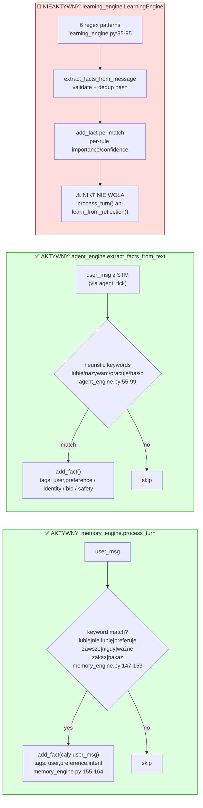

---

## 10. Research Engine — [PLACEHOLDER, 0 WYNIKÓW]

### DOWODY:

- ResearchEngine.research: `aihub/research_engine.py:112-181`
- \_generate_placeholder_results: `aihub/research_engine.py:184-189` → **return []**
- Callers: `cognitive_controller._decide_research` zwraca DecisionResult z `action_type="research"` ale `_execute_action` w `agent_loop.py:155` to STUB. `agent_engine.execute_task` NIE obsługuje type="research".

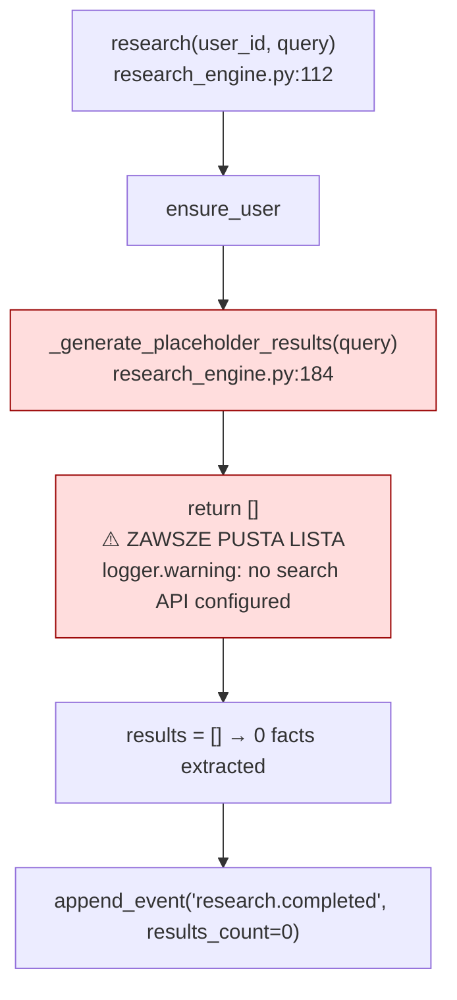

---

## 11. Architektura pamięci — Warstwy i przepływ (zweryfikowane)

### DOWODY:

- Schemat DB: `aihub/db.py:22-120`
- STM (stm_messages): `aihub/db.py:67-75`
- L1/L2 (memory_nodes): `aihub/db.py:27-50`
- FTS5 (memory_fts): `aihub/db.py:53-60`
- memory_meta: `aihub/db.py:95-112`
- memory_facts VIEW: `aihub/db.py:115-120`
- Vector files: `aihub/vector_engine.py:16-19`

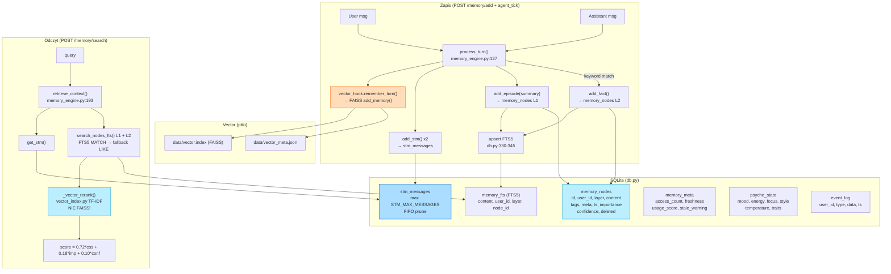

---

## Podsumowanie: Co jest w kodzie, a co NIE żyje w runtime

| Moduł                | Import w runtime?                                | Wywołanie w runtime?                                                        | Status                  |
| -------------------- | ------------------------------------------------ | --------------------------------------------------------------------------- | ----------------------- |
| memory_engine        | ✅ main.py:44                                    | ✅ /memory/add, /memory/search, /turn, agent_tick                           | **AKTYWNY**             |
| psyche_engine        | ✅ main.py:47                                    | ✅ /psyche/\*, /memory/add, agent_tick                                      | **AKTYWNY**             |
| vector_hook          | ✅ memory_engine.py:21                           | ✅ process_turn() → remember_turn()                                         | **AKTYWNY (zapis)**     |
| vector_engine        | ✅ vector_hook.py:1                              | ✅ add_memory() z FAISS                                                     | **AKTYWNY (zapis)**     |
| vector_index         | ✅ memory_engine.py:22-27                        | ✅ \_vector_rerank() w retrieve_context()                                   | **AKTYWNY (odczyt)**    |
| cognitive_controller | ✅ main.py:49                                    | ✅ POST /cognitive/decide                                                   | **AKTYWNY**             |
| agent_worker         | ✅ main.py:51                                    | ✅ start_worker_once() at startup                                           | **AKTYWNY**             |
| agent_engine         | ✅ agent_api.py:16 + agent_worker.py:12          | ✅ agent_tick() co 3.5s                                                     | **AKTYWNY**             |
| agent_loop           | ✅ agent_api.py:84                               | ⚠️ TYLKO POST /agent/loop (ręczny)                                          | **SEMI-AKTYWNY**        |
| attention_controller | ✅ cognitive_controller.py:21 + agent_loop.py:17 | ⚠️ W agent_loop (ręczny), w cognitive_controller instancja ale brak wywołań | **SEMI-AKTYWNY**        |
| prediction_engine    | ✅ cognitive_controller.py:28                    | ✅ predict_next_action() w decide()                                         | **AKTYWNY**             |
| conflict_detector    | ✅ cognitive_controller.py:22 + main.py:50       | ✅ check_conflict() w decide()                                              | **AKTYWNY**             |
| meta_memory          | ✅ cognitive_controller.py:26                    | ✅ check_stale() w \_estimate_memory_pressure()                             | **AKTYWNY (częściowo)** |
| knowledge_graph      | ✅ cognitive_controller.py:24 + main.py          | ✅ stats() w /cognitive/health                                              | **AKTYWNY (częściowo)** |
| learning_engine      | ✅ cognitive_controller.py:27                    | ❌ Instancja istnieje, BRAK wywołań metod                                   | **MARTWY KOD**          |
| research_engine      | ❌ Brak importu w main/agent                     | ❌ Placeholder (return [])                                                  | **MARTWY KOD**          |
| memory_gc            | ❌ Brak importu w main/agent                     | ❌ Nikt nie woła collect_garbage()                                          | **MARTWY KOD**          |
| knowledge_evolution  | ✅ memory_gc.py:17                               | ❌ Tylko przez memory_gc (który jest martwy)                                | **MARTWY KOD**          |
